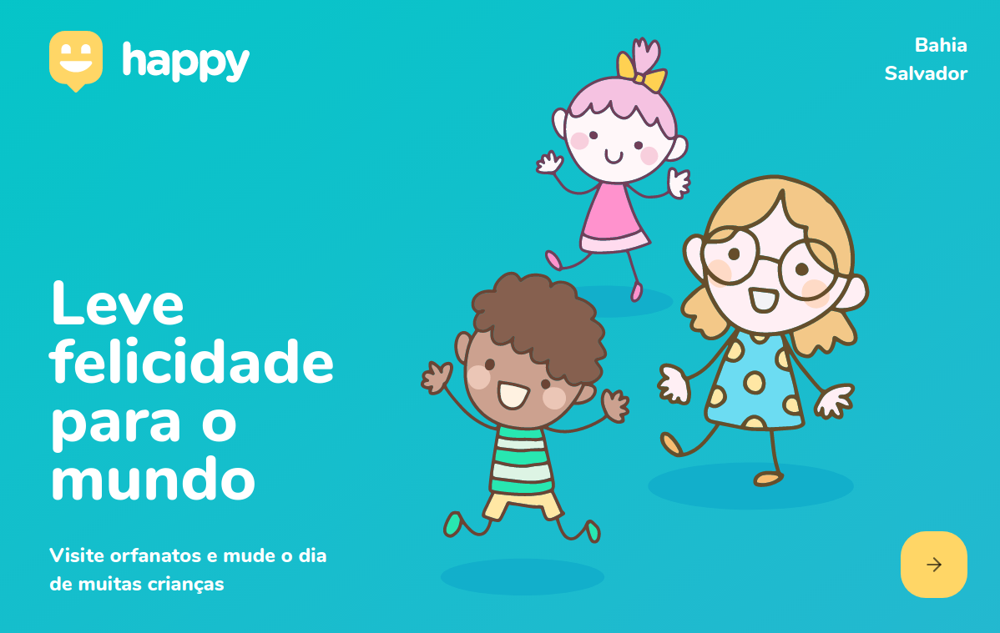
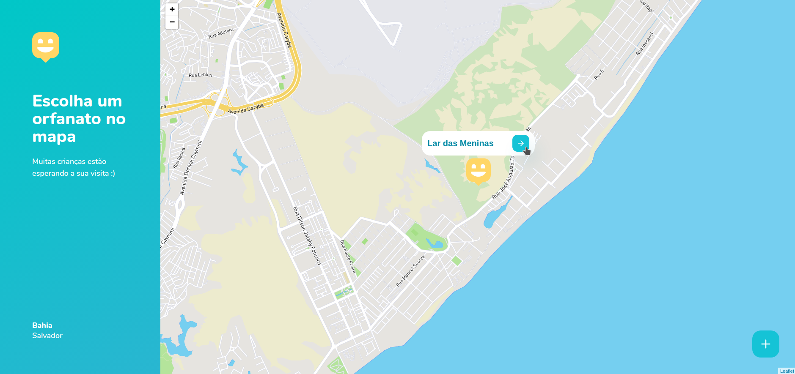
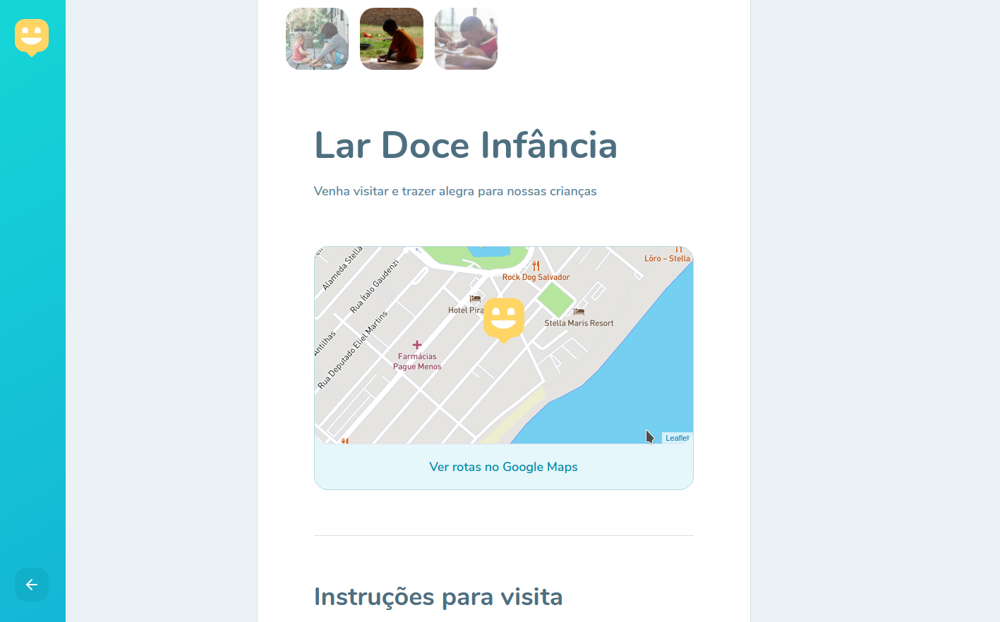

<h1 align="center">
    Happy
</h1>

  <a href="#-tecnologias">Tecnologias</a>&nbsp;&nbsp;&nbsp;|&nbsp;&nbsp;&nbsp;
  <a href="#-projeto">Projeto</a>&nbsp;&nbsp;&nbsp;

 

  
  
  

## 🚀 Tecnologias

Esse projeto foi desenvolvido com as seguintes tecnologias:

- [Node.js](https://nodejs.org/en/)
- [React](https://reactjs.org)
- [TypeScript](https://www.typescriptlang.org/)

## 💻 Projeto

O Happy é uma aplicação em que pessoas possam encontrar centros de acolhimento em sua região e realizar visitas para ajudar e tornar mais alegre a vida das pessoas assistidas por esses centros. A RocketSeat é a idealizadora desse projeto e em cada semana de programação traz uma aplicação mais bacana que outra
